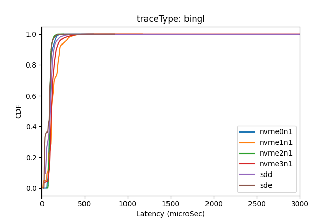
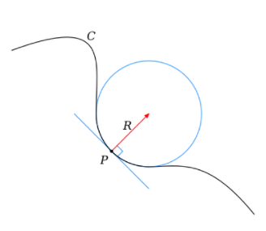
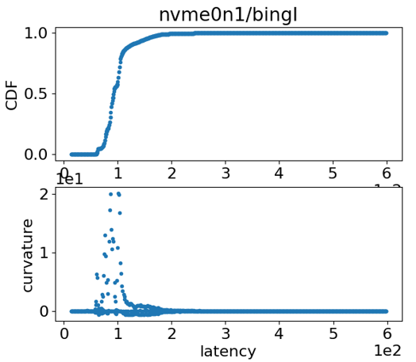
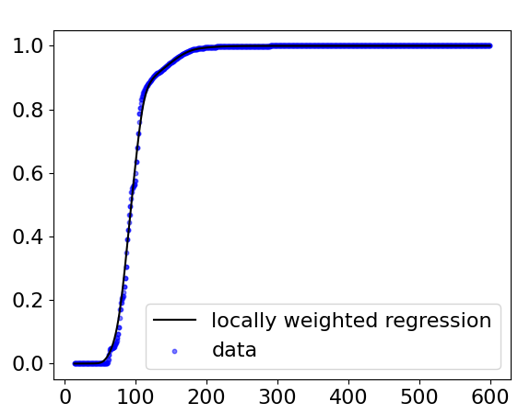
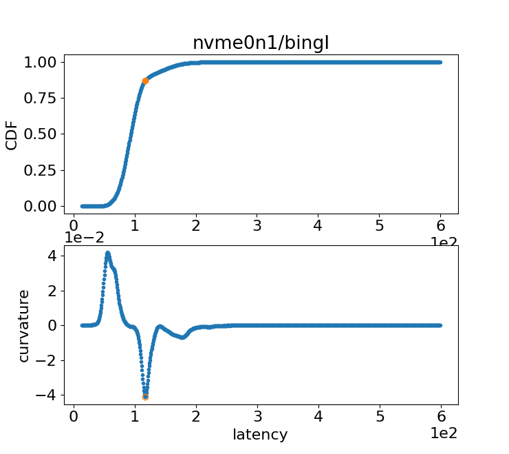

# OS_trace

Flash devices have many background operations (latency interruptions), such as garbage collection, wear leveling. This leads to the
Long-tail distribution of latency.

Below shows the distribution of latency for several commercial SSD.

## Curvature method for Inflection point

* curvature is the inverse of the radius of the fitted circle

concave curve ~ negative k

convex curve ~ positive k

* Curvature of raw CDF

Since CDF is not smooth, curvature in the microscale covers the curvature in the macroscale as shown below.

* Locally weighted regression
We first apply LW regression to smooth the CDF curve.

* Set scaling for CDF

CDF has different unit for its x and y label.
If we choose different scaling for percent 
and latency, curvature will be different.
In our example, we set the x and y values of p95 point to be equal. 

* Inflection Point

The inflection point corresponds to the minimum point of the curvature of the smoothed CDF.

